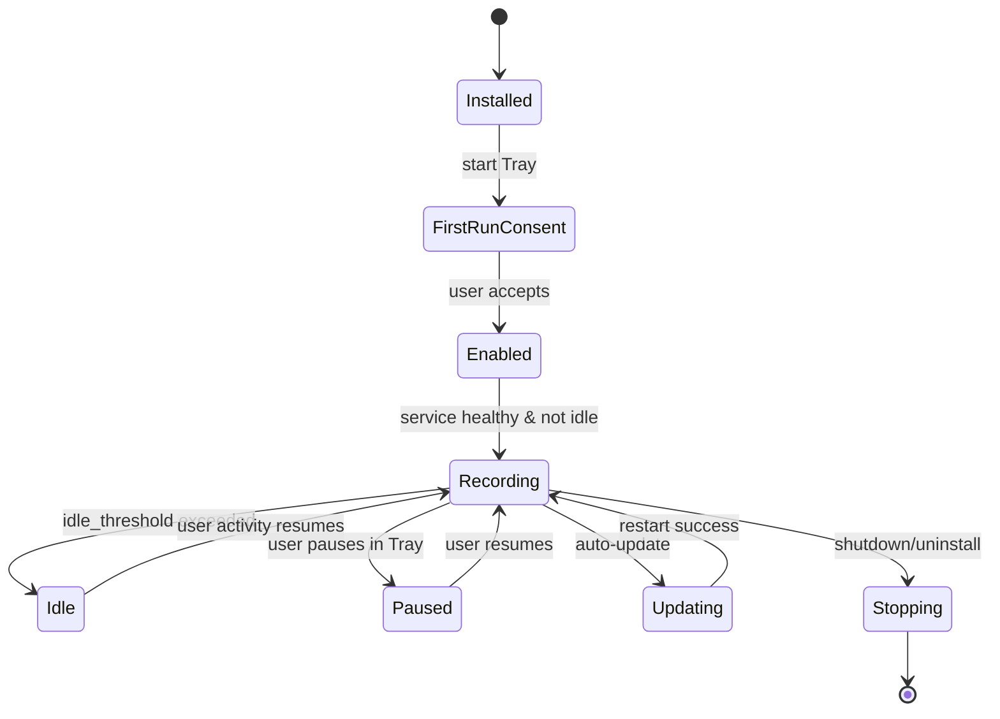

# Work\_Flow\.md — Windows Monitoring Agent (không dùng extension)

**Phiên bản:** 1.0
**Ngày:** 24/08/2025
**Tài liệu tham chiếu:** Prompt.md, Plan.md, Diagram.md

---

## 0) Mục đích & Phạm vi

Tài liệu này mô tả **quy trình vận hành (workflow)** cấp chi tiết cho agent giám sát trên Windows: từ cài đặt, khởi động, thu thập, gộp phiên, ghi cục bộ, đồng bộ server, tạm dừng/tiếp tục, cập nhật đến gỡ bỏ. Nội dung bám sát kiến trúc và mục tiêu đã chốt, **không** sử dụng extension trình duyệt, **không** thu bàn phím/chụp màn hình.

---

## 1) Vai trò & Ranh giới

* **Agent Service** (Windows Service): tiến trình nền chạy collectors, gộp phiên, ghi queue, upload.
* **Tray App** (User Session): UI minh bạch cho Pause/Resume, trạng thái.
* **Collectors**: `proc_focus`, `uia_web`, `history_backfill` (tùy chọn), `etw_domain` (tùy chọn).
* **WebAPI** (FastAPI): ingest, catalog, overrides, health.
* **DB Cục bộ**: SQLite queue + cache. **DB Server**: PostgreSQL/MySQL.
* **Security**: JWT + TLS; code-sign; chính sách giữ liệu.

---

## 2) Lifecycle tổng thể



---

## 3) Quy trình cài đặt & First-Run Consent

**Mục tiêu:** cài service, tạo shortcut Tray, thu thập consent.

**Trigger:** người dùng chạy installer (MSI/EXE).
**Tiền điều kiện:** tài khoản có quyền cài đặt; chứng chỉ ký hợp lệ.
**Các bước:**

1. Installer copy file, đăng ký Windows Service (auto-start), tạo shortcut Tray trong Startup.
2. Khởi chạy Tray → hiển thị màn hình **Consent** nêu rõ dữ liệu thu thập; lưu `consented_at`, `policy_version`.
3. Nếu consent **OK** → ghi enable flag; nếu **Cancel** → không khởi động service.

**Đầu ra:** service chạy với config mặc định; bản ghi consent.
**Giám sát:** log Installer, Tray, Service; kiểm `/v1/healthz`.
**Tiêu chí chấp nhận:** service **Running**, Tray hiển thị **Recording** khi được phép.

---

## 4) Workflow khởi động Service (Boot)

**Mục tiêu:** đưa agent từ stop → sẵn sàng thu thập.

**Trigger:** Windows khởi động/Restart service.
**Bước:**

1. Nạp **config** (YAML/JSON) + biến môi trường; validate.
2. Khởi tạo **Logging**, **Metrics**, kết nối SQLite; kiểm tra và migrate schema cục bộ nếu cần.
3. Bật **Idle Detector**.
4. Khởi động collectors: `proc_focus` → `uia_web` → (`history_backfill`, `etw_domain` nếu bật).
5. Khởi tạo **Session Aggregator** & **Batcher**; mở **Uploader** (chưa đồng bộ nếu offline).
6. Xuất trạng thái **healthy**; chờ sự kiện foreground đầu tiên.

**Tiêu chí chấp nhận:** tất cả collectors **ready**; healthcheck `OK`.

---

## 5) Workflow theo dõi Ứng dụng (proc\_focus)

**Mục tiêu:** ghi phiên ứng dụng theo foreground.

**Trigger:** Windows phát sinh `EVENT_SYSTEM_FOREGROUND` hoặc timer debounce.
**Bước:**

1. Xác định `hwnd` foreground → tra **PID**, **exe\_path**, **app\_id** (tạo nếu mới, băm SHA-256).
2. Đọc `window_title` (sample).
3. Kiểm tra **Idle**: nếu idle → đóng phiên hiện tại (nếu có), không mở mới.
4. Nếu **Not idle**:

   * Đóng phiên trước (nếu app khác), tính `active_seconds`.
   * Mở phiên mới cho app hiện tại (ghi `started_at`).
5. Ghi **event** vào queue (batch) → SQLite.

**Lỗi/Retry:** thiếu quyền, không lấy được title → log warning; vẫn ghi nhận theo app.
**Giám sát:** tỷ lệ sự kiện foreground lỗi < 1%; độ trễ cập nhật < 200ms.

---

## 6) Workflow theo dõi Web qua UIA (uia\_web)

**Mục tiêu:** ghi URL + title của tab **foreground**.

**Trigger:** foreground là `chrome/msedge/firefox`; hoặc poll 1–2s.
**Bước:**

1. Dò cây UI Automation → tìm **Address Bar** (role `Edit`/`ComboBox`, AutomationId đã biết).
2. Đọc `Value` (URL) + `Tab Title`.
3. Gộp **web\_session** theo (browser, URL) với `started_at/ended_at`.
4. Đồng bộ với trạng thái **Idle** để cộng `active_seconds` chính xác.
5. Ghi sự kiện vào queue (batch).
   **Fallback:** nếu không đọc được URL → chỉ lưu **domain** (giải từ title) hoặc chờ **ETW** (nếu bật).

**Lỗi/Retry:** selector UIA thay đổi → dùng danh sách selector dự phòng, tăng backoff; mở cảnh báo trong metrics.
**Giám sát:** tỷ lệ lấy URL thành công ≥ 95% trong 3 trình duyệt hỗ trợ.

---

## 7) Workflow Backfill Lịch sử (tùy chọn)

**Trigger:** cron nội bộ mỗi 5–10 phút.
**Bước:**

1. Xác định hồ sơ người dùng & vị trí file History SQLite; **copy sang temp**.
2. Đọc bảng `urls/visits`, lọc trong khoảng thời gian chưa đầy đủ.
3. Map visits ↔ khoảng foreground để ước lượng `active_seconds`; tạo/merge `web_sessions`.
4. Ghi batch vào queue.

**Tiêu chí:** không khóa file gốc; không tạo trùng lặp; chỉ lấp khoảng trống UIA.

---

## 8) Workflow ETW Domain (tùy chọn)

**Trigger:** collector ETW chạy nền.
**Bước:**

1. Đăng ký providers TCPIP/WinInet/MsQuic.
2. Nhận sự kiện network, map **PID ⇄ domain** (SNI/Host).
3. Với foreground là trình duyệt nhưng UIA miss → ghi **domain-level** session (không path).
4. Cờ `source=etw` để phân biệt.

**Tiêu chí:** domain only, không path; không vượt tải CPU.

---

## 9) Aggregation & Idle Handling

**Mục tiêu:** hợp nhất sự kiện thành phiên bền vững, chính xác.

**Bước:**

1. **Merge rules**: cùng app/URL liên tiếp, cách nhau < ngưỡng (vd 5s) → gộp.
2. **Idle rules**: khi idle → đóng phiên đang mở, ngừng cộng thời gian; khi hoạt động trở lại → mở phiên mới.
3. **Overlap guard**: đảm bảo không trùng thời gian giữa các phiên cùng loại.
4. **Sampling**: lưu `window_title_sample` và `title` ở mức vừa đủ.

**Tiêu chí:** không có overlap; sai số thời lượng < 2% so với stopwatch kiểm thử.

---

## 10) Ghi cục bộ & Quản lý hàng đợi (SQLite)

**Bước:**

1. Nhận events từ Aggregator → **Batcher** gom N bản ghi hoặc T ms.
2. Ghi **transaction** vào SQLite; tạo index theo `(user_id, started_at)`…
3. **Log rotation**: nén & xoá bản ghi cũ theo `retention_days` sau khi đã đồng bộ.
4. **Backpressure**: nếu DB bận hoặc đầy → tăng batch size/interval; phát cảnh báo khi vượt ngưỡng.

**Tiêu chí:** không mất dữ liệu khi mất điện đột ngột; phục hồi sau restart.

---

## 11) Đồng bộ server (Uploader)

**Trigger:** định kỳ mỗi `batch.interval_ms` hoặc khi đủ N bản ghi; chỉ chạy khi **online**.
**Bước:**

1. Lấy batch từ SQLite → đóng gói **AppSession/WebSession** theo schema.
2. Ký **JWT**, gọi `POST /v1/ingest/*` qua **TLS**.
3. Nhận ACK → **xoá** các bản ghi đã gửi thành công.
4. **Retry/backoff** theo cấp số nhân khi lỗi mạng/5xx; **cắt mạch** (circuit-breaker) nếu lỗi liên tiếp.
5. Ghi **metrics**: throughput, fail rate, queue depth.

**Tiêu chí:** không gửi trùng; không block collectors khi server lỗi.

---

## 12) Pause/Resume (Tray ↔ Service)

**Trigger:** người dùng nhấn Pause/Resume trong Tray.
**Bước:**

1. Tray gửi IPC `SET_STATE(PAUSE/RESUME)`.
2. Service cập nhật cờ runtime: khi **PAUSE** → dừng mở phiên mới & đóng các phiên hiện tại.
3. UI Tray cập nhật biểu tượng/trạng thái; hiển thị banner cảnh báo khi Paused.
4. Resume → collectors hoạt động lại bình thường.

**Tiêu chí:** khi Pause, **không** có sự kiện mới trong DB.

---

## 13) Cấu hình nóng (Hot-Reload)

**Trigger:** file config thay đổi hoặc lệnh từ Tray/CLI.
**Bước:**

1. Validate config mới; nếu hợp lệ → apply **không cần restart** cho tham số an toàn (poll, idle threshold…).
2. Tham số nguy hiểm (bật/tắt collectors) có thể yêu cầu **restart service** có kiểm soát.
3. Lưu snapshot cấu hình & audit log.

**Tiêu chí:** không gián đoạn dài; rollback khi áp dụng thất bại.

---

## 14) Auto-Update an toàn

**Trigger:** tác vụ kiểm tra phiên bản theo lịch.
**Bước:**

1. Tải gói update, **kiểm tra chữ ký**.
2. Chuyển sang trạng thái **Updating** → tạm dừng collectors, flush queue.
3. Cập nhật file nhị phân; restart service + Tray.
4. Nếu thất bại → **rollback**; ghi sự cố.

**Tiêu chí:** không mất dữ liệu; downtime < 10 giây.

---

## 15) Shutdown/Uninstall

**Trigger:** lệnh stop service hoặc gỡ cài đặt.
**Bước:**

1. Dừng collectors; flush queue; gửi batch cuối (nếu online).
2. Đóng DB cục bộ an toàn.
3. Gỡ đăng ký service; xoá file theo checklist (trừ dữ liệu nếu người dùng chọn giữ).
4. Cập nhật audit log.

**Tiêu chí:** không còn tiến trình nền; không để lại handle mở.

---

## 16) Runbooks (SOP) thường gặp

### 16.1 URL không lấy được trên Chrome/Edge/Firefox

1. Kiểm tra version trình duyệt; 2) So khớp selector UIA; 3) Bật fallback domain/ETW; 4) Cập nhật danh sách `AutomationId` → phát hành hotfix.

### 16.2 Queue đầy/đồng bộ chậm

1. Xem metrics queue depth; 2) Tăng `batch.size`/`interval_ms`; 3) Kiểm tra TLS/JWT; 4) Bật circuit-breaker; 5) Xả queue thủ công (CLI) nếu server ngừng dài hạn.

### 16.3 Lịch sử bị khoá

1. Đảm bảo copy sang temp trước khi đọc; 2) Giảm tần suất backfill; 3) Bật chỉ đọc.

### 16.4 Chứng chỉ/Tokens hết hạn

1. Gia hạn cert; cập nhật `tls.cert_path`; 2) Rotate JWT; 3) Kiểm tra health tất cả agent.

### 16.5 Mất dữ liệu do mất điện

1. Kiểm tra integrity SQLite; 2) Chạy VACUUM/PRAGMA; 3) Khôi phục từ WAL; 4) Xác nhận upload lại các batch chưa ACK.

---

## 17) Quan trắc & Báo động (Observability)

* **Logs có cấu trúc**: collector, aggregator, uploader; mã lỗi, độ trễ, kích thước batch.
* **Metrics**: CPU/RAM, queue depth, success rate upload, URL capture success, idle ratio.
* **Alerts**:

  * URL capture success < 90% trong 10 phút.
  * Upload fail rate > 5% trong 15 phút.
  * Queue depth > ngưỡng N bản ghi.
  * CPU > 5% kéo dài > 10 phút.

---

## 18) Kiểm thử & Chấp nhận (liên kết DoD)

* **Unit**: Idle detector, session merger, UIA URL reader, History reader, ETW mapper.
* **Integration**: ingest API, dedupe, backoff, circuit-breaker.
* **Perf**: đổi foreground 5–10 lần/giây trong 15 phút; đo CPU < 2%, RAM < 150MB.
* **UAT**: Pause/Resume đúng; mất mạng & retry; xuất CSV; Dashboard Top app/domain & heatmap.
* **Acceptance**: đạt tất cả tiêu chí DoD đã chốt.

---

## 19) Phụ lục A — Dòng chảy chi tiết (Flow-by-Flow)

### A.1 Foreground → AppSession

1. Event FOREGROUND → map PID/exe → close prev → open new → queue.
2. Debounce 200ms; ignore flicker.
3. Khi idle → close; khi resume → open mới.

### A.2 Foreground Browser → WebSession

1. Phát hiện browser → UIA đọc URL/title.
2. Nếu URL đổi trong cùng tab → cập nhật `ended_at` phiên cũ, mở phiên mới.
3. Nếu không đọc được → chờ ETW/domain.

### A.3 Upload

1. Read batch → POST ingest → ACK → delete;
2. 429/5xx → backoff;
3. TLS/JWT lỗi → rotate token/cert.

---

## 20) Phụ lục B — Cấu hình mẫu (tham khảo)

```yaml
idle_threshold_seconds: 60
poll_interval_ms: 1000
features:
  history_backfill: true
  etw_domain: false
storage:
  sqlite_path: data/agent.db
  retention_days: 90
api:
  base_url: https://server.local
  jwt: "<token>"
  tls_cert_path: certs/agent.pfx
logging:
  level: INFO
batch:
  size: 100
  interval_ms: 1000
```

---

## 21) Track thay đổi (Change Log)

* **1.0 (24/08/2025):** Bản đầu tiên, đồng bộ với Prompt/Plan/Diagram; thêm runbooks & acceptance rõ ràng.
